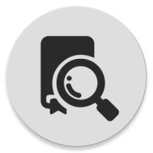
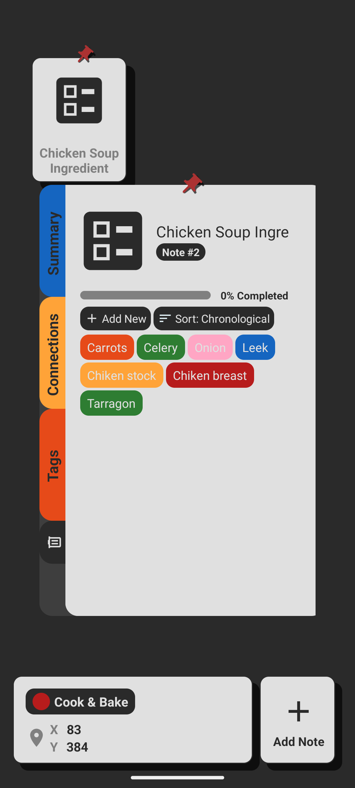
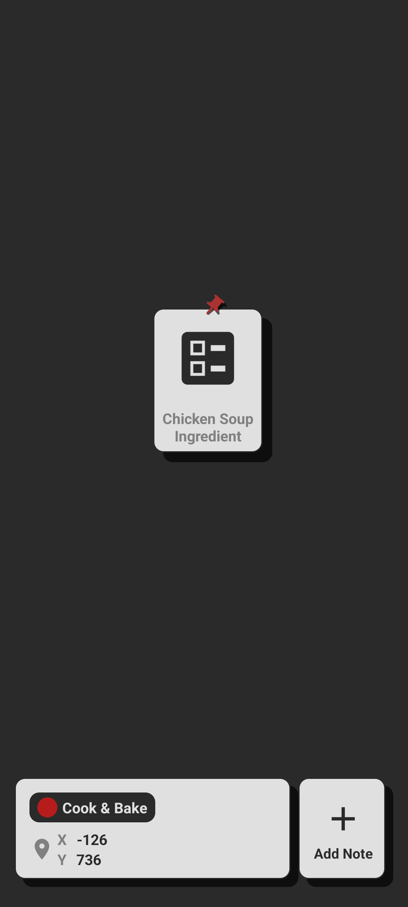
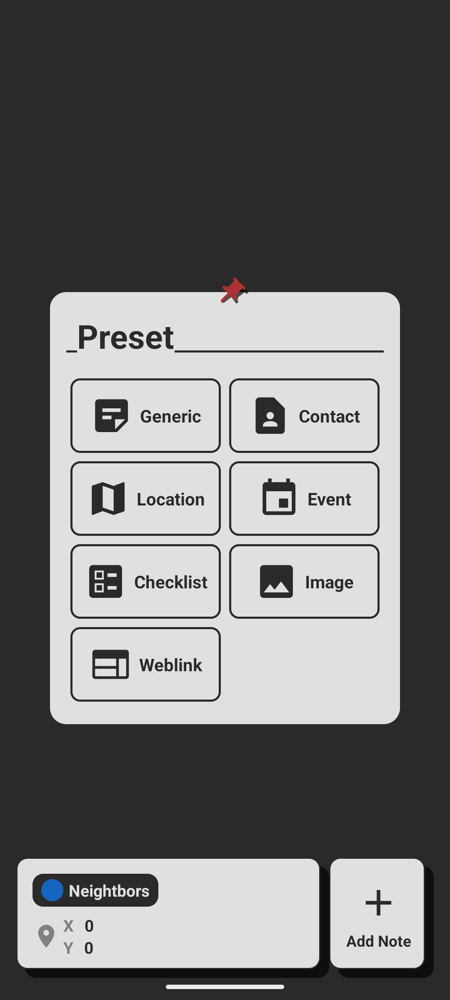
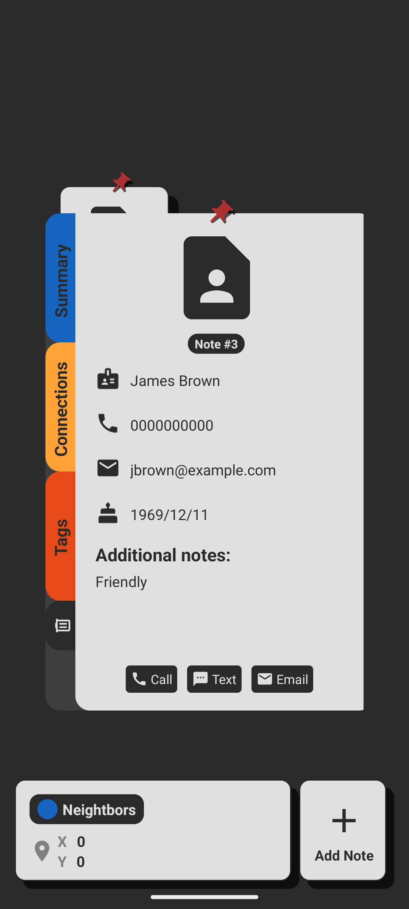
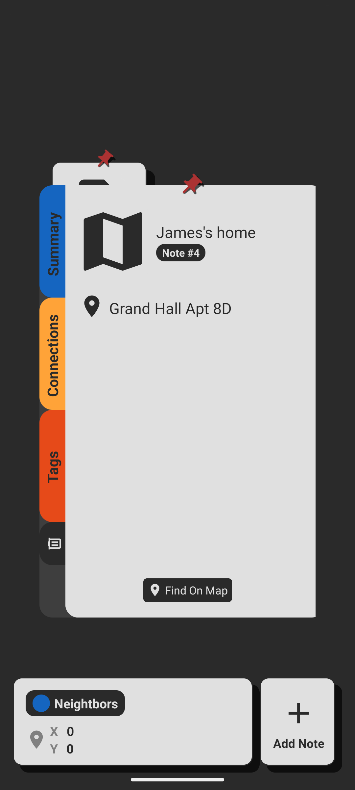
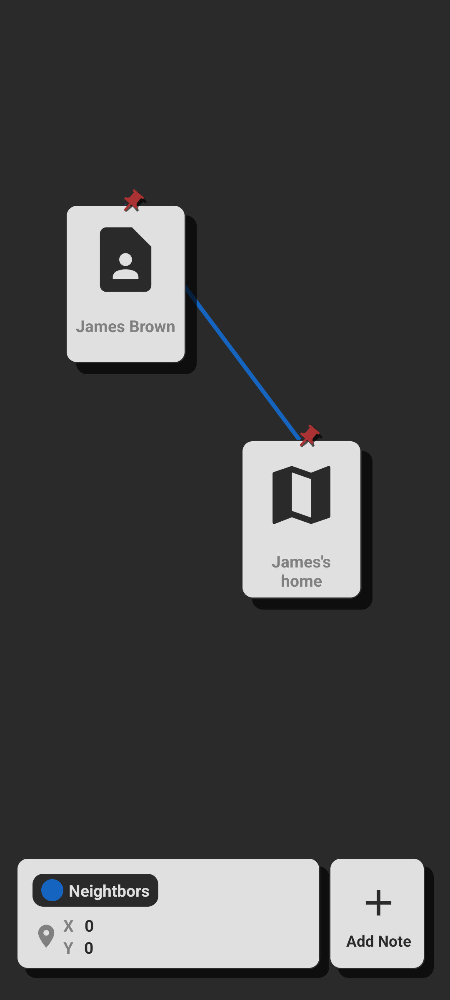
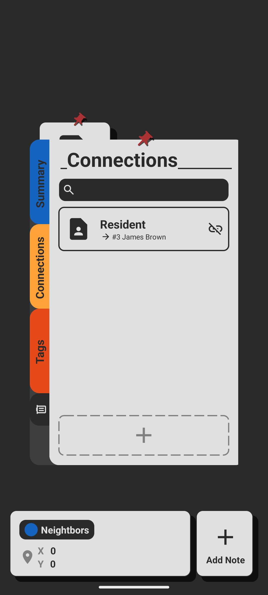
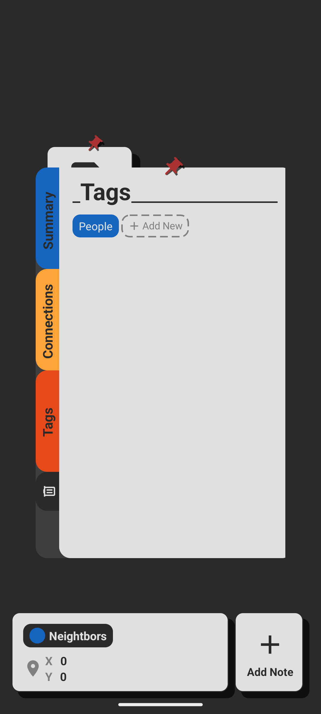

 
<h1 align="center"><b>JotterBox</b></h1>
<h4 align="center">Manager your notes, detective style</h4>

## Screenshots

## Features
- Infinite scrolling board, with infinite number of note on each board
- Multiple board, with the ability to rename and change icon color
- Different note types, with action attach to the note to open on other apps
- Create connections between notes, with "a string" rendered between them on the board
- Tag different notes with related topics
- Save regions on the board, so notes won't get lost in the infinite void

## License
This program is under Apache License Version 2.0, January 2004. Please do not re-upload it to the Google PlayStore.

Copyright (C) 2023 Khoa Nguyen (Risky/Reesque)